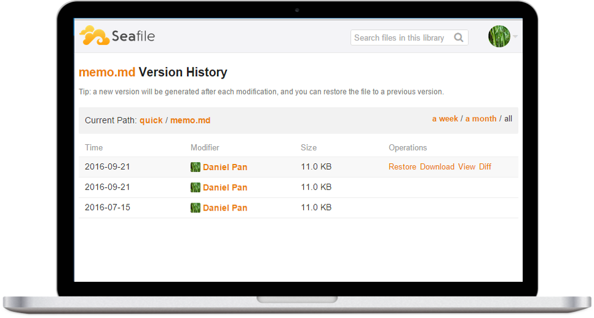

<!--
To README zostało automatycznie wygenerowane przez <https://github.com/YunoHost/apps/tree/master/tools/readme_generator>
Nie powinno być ono edytowane ręcznie.
-->

# Seafile dla YunoHost

[](https://ci-apps.yunohost.org/ci/apps/seafile/)


[](https://install-app.yunohost.org/?app=seafile)

*[Przeczytaj plik README w innym języku.](./ALL_README.md)*

> *Ta aplikacja pozwala na szybką i prostą instalację Seafile na serwerze YunoHost.*  
> *Jeżeli nie masz YunoHost zapoznaj się z [poradnikiem](https://yunohost.org/install) instalacji.*

## Przegląd

Seafile is an open Source Cloud Storage application.

It's a Enterprise file sync and share platform with high reliability and performance. It's a file hosting platform with high reliability and performance. Put files on your own server. Sync and share files across different devices, or access all the files as a virtual disk.


**Dostarczona wersja:** 11.0.13~ynh1

**Demo:** <https://demo.seafile.com>

## Zrzuty ekranu



## Dokumentacja i zasoby

- Oficjalna strona aplikacji: <https://www.seafile.com>
- Oficjalna dokumentacja dla administratora: <https://manual.seafile.com>
- Repozytorium z kodem źródłowym: <https://github.com/haiwen/seafile-server>
- Sklep YunoHost: <https://apps.yunohost.org/app/seafile>
- Zgłaszanie błędów: <https://github.com/YunoHost-Apps/seafile_ynh/issues>

## Informacje od twórców

Wyślij swój pull request do [gałęzi `testing`](https://github.com/YunoHost-Apps/seafile_ynh/tree/testing).

Aby wypróbować gałąź `testing` postępuj zgodnie z instrukcjami:

```bash
sudo yunohost app install https://github.com/YunoHost-Apps/seafile_ynh/tree/testing --debug
lub
sudo yunohost app upgrade seafile -u https://github.com/YunoHost-Apps/seafile_ynh/tree/testing --debug
```

**Więcej informacji o tworzeniu paczek aplikacji:** <https://yunohost.org/packaging_apps>
